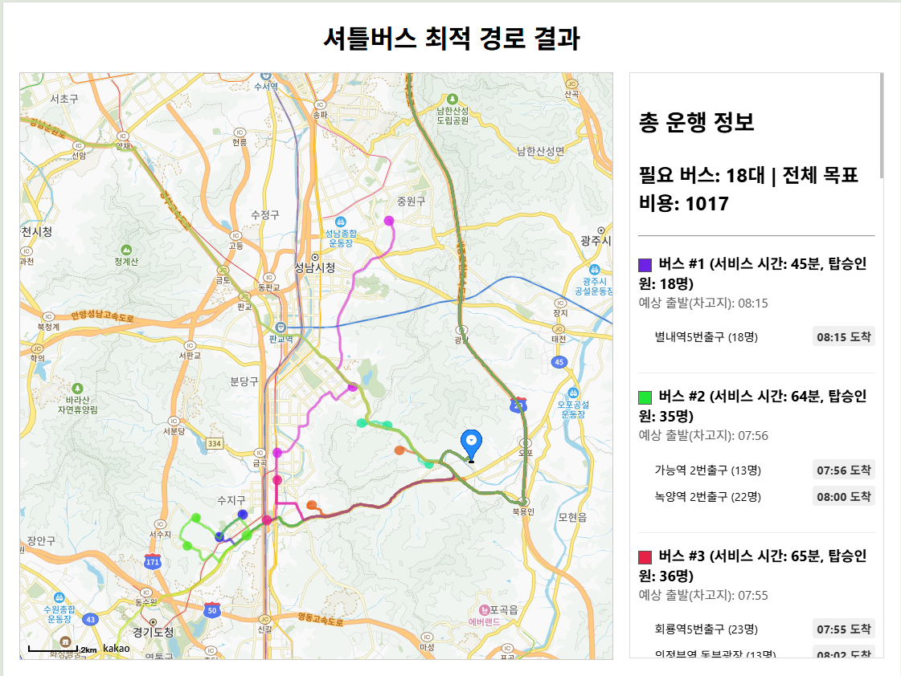

# 셔틀버스 최적 경로 계산 시스템 (Shuttle Bus Route Optimization System)
## 1. 프로젝트 개요 (Overview)
본 프로젝트는 주어진 정류장 목록과 수요 데이터를 바탕으로, 다수의 셔틀버스 운행 경로를 자동으로 생성하고 최적화하는 스프링 부트 기반의 웹 애플리케이션입니다. Google OR-Tools의 차량 경로 문제(VRP) 솔버를 핵심 엔진으로 사용하여, 다양한 운영 제약 조건 하에서 가장 효율적인 버스 노선을 도출하는 것을 목표로 합니다.

계산된 결과는 Kakao Maps API와 연동하여 웹 페이지에 동적으로 시각화됩니다.

## 2. 핵심 기능 (Key Features)
동적 수요 분할: 버스 정원을 초과하는 정류장의 수요를 여러 개의 가상 정류장으로 자동 분할하여 여러 대의 버스가 방문하도록 처리합니다.

실시간 이동 시간 계산: Kakao Mobility API를 호출하여, 실제 도로 교통 상황이 반영된 정류장 간의 실시간 이동 시간 데이터를 사용합니다.

API 호출 캐싱: 한 번 계산된 이동 시간은 **JSON 파일에 저장(캐싱)**하여, 불필요한 API 호출을 최소화하고 실행 속도를 대폭 향상시킵니다.

다중 제약조건 기반 최적화: 다음과 같은 복잡하고 현실적인 제약조건을 모두 만족하는 최적의 경로를 탐색합니다.

각 버스의 최대 탑승 인원 (정원) 제한

첫 경유지부터 마지막 경유지까지의 최대 서비스 시간 제한

경유지 간 이동 시간에 대한 권고 사항 (초과 시 페널티 부과)

동적 시각화: 계산된 최종 결과를 웹 브라우저의 동적 지도 위에 각 버스 경로별로 다른 색상으로 표시하고, 상세 운행 정보를 함께 제공합니다.

## 3. 주요 기술 스택 (Tech Stack)
분류	라이브러리 / 프레임워크	주요 역할
백엔드 프레임워크	Spring Boot	웹 서버 구축 
최적화 엔진	Google OR-Tools	
Kakao Mobility API	
외부 API (클라이언트)	Kakao Maps JavaScript API
테스트 프레임워크	JUnit 5	자바 코드의 각 기능(단위)이 올바르게 작동하는지 검증
JSON 처리	Jackson	자바 객체(DTO)와 JSON 문자열 간의 자동 변환 처리

Export to Sheets

## 4. 실행 방법 (Setup and Execution)
### 1단계: API 키 설정
src/main/resources/application.properties 파일을 엽니다.

Properties

### 카카오 개발자 사이트에서 발급받은 REST API 키를 입력합니다.
kakao.api.key=YOUR_KAKAO_REST_API_KEY
src/main/resources/static/index.html 파일을 엽니다.

HTML

#### 참고: 카카오 개발자 사이트의 [플랫폼 설정]에서 웹 플랫폼으로 http://localhost:8080을 반드시 등록해야 합니다.

### 2단계: 애플리케이션 실행
IDE에서 BusTspApplication.java 파일을 찾아 실행합니다.

또는, 프로젝트 루트 폴더의 터미널에서 아래 명령어를 실행합니다.

Bash

# Windows
gradlew bootRun

# macOS / Linux
./gradlew bootRun
3단계: 결과 확인
웹 브라우저를 열고 http://localhost:8080 주소로 접속합니다.

"경로 계산 중..." 메시지가 잠시 표시된 후, 최적화가 완료되면 동적 지도와 상세 정보가 화면에 나타납니다.

## 5. 주요 파라미터 설정
알고리즘의 동작을 제어하는 주요 상수들은 RouteOptimizationService.java 파일 상단에 정의되어 있어 쉽게 수정하고 테스트할 수 있습니다.

#### 버스 한 대의 최대 탑승 가능 인원 
private static final int VEHICLE_CAPACITY = 45;
#### 알고리즘이 사용할 수 있는 최대 가용 버스 대수   
private static final int MAX_VEHICLES = 1005;  
####  경유지 사이의 이동 시간 제한 (페널티 기준)   
private static final long STOP_TO_STOP_TIME_LIMIT = 20;  
####  첫 경유지부터 마지막 경유지까지의 최대 허용 운행 시간   
private static final long MAX_SERVICE_TIME = 120;  
#### 최적 해 탐색 최대 시간   
private static final long SEARCH_TIME_LIMIT_SECONDS = 5;  

# 시연 이미지

## 개선 가능한 사항

1. 차량마다 다른 용량으로 설정 가능함  
2. 사용자의 입력에 따라 경로를 재 생성 가능함
3. 데이터 베이스 적용
4. 